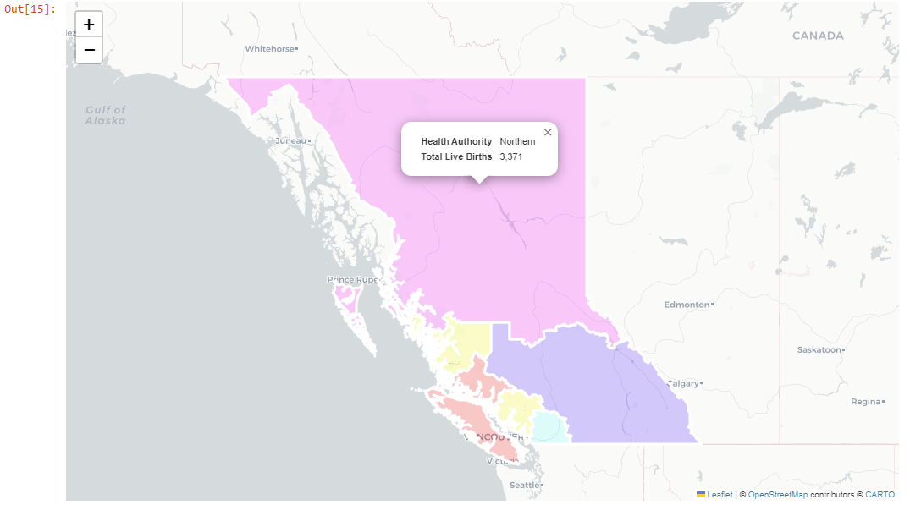

# BC Health Authorities Map Visualization
## Overview
This Jupyter notebook (BC_HA_Map_v1.ipynb) provides a visualization of British Columbia's Health Authority regions using GeoPandas and Folium. It aims to showcase the geographical boundaries of each health authority and allows for interactive exploration with customized popups displaying the name of each health authority.

## Features
GeoPandas for Geospatial Data: Utilizes GeoPandas to load and manipulate geospatial data from a GeoJSON file (https://catalogue.data.gov.bc.ca/dataset/health-authority-boundaries/resource/581168b5-7014-41fd-86ec-334137d6bc4e ), ensuring accurate representation of health authority boundaries.

## Folium for Interactive Maps: 
Employs Folium to create interactive maps that can be easily explored through a web interface. Folium's capabilities allow for the addition of tooltips and popups to enhance user interaction.

## Custom Styling: 
Implements custom styling for each health authority region based on predefined criteria, making it easier to distinguish between different regions on the map.

## Interactive Elements: 
Includes interactive elements such as tooltips and popups, providing additional information about each health authority region upon interaction.

## Environment Setup: 
Ensure you have Jupyter Notebook or JupyterLab installed, along with GeoPandas and Folium. These can be installed via pip:

## Copy code
pip install jupyterlab geopandas folium

## Data: 
The notebook uses a GeoJSON file containing the boundaries and names of British Columbia's Health Authorities. Make sure the file is located in the correct directory as specified in the notebook.

## Execution:
Run the notebook cells sequentially. The final output is an interactive map displayed within the notebook interface.

## Interaction: 
Explore the map by hovering over and clicking on different health authority regions to view their names and additional information.

## Customization
Changing Styles: Modify the colorize function to change the color scheme used for different health authorities.
Additional Data: Incorporate more data into the popups by adjusting the feature_popup function and including additional fields from the GeoJSON file.

## Contributions
Contributions to improve or extend the functionality of this notebook are welcome. Please feel free to fork the repository, make your changes, and submit a pull request.
